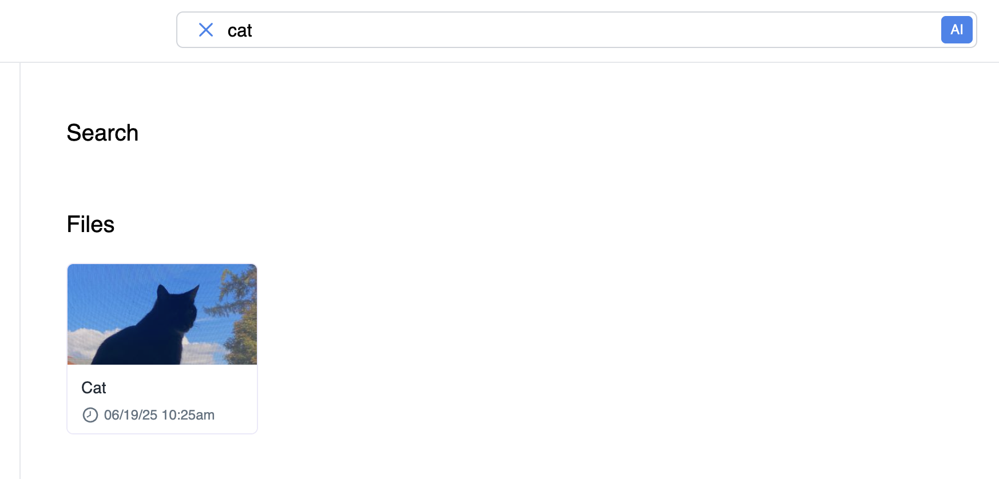

# Cloud9 User Guide

Welcome to Cloud9, your AI-powered cloud storage and semantic search platform. This guide will help you get started, manage your files, and make the most of Cloud9’s advanced features.

---

## 1. What is Cloud9?
Cloud9 is a secure, intelligent cloud storage service that lets you:
- Upload, store, and organize files and folders
- View images and videos directly in your browser
- Share files securely with signed links
- Host digital certificates publicly
- Distribute documents via email
- Find files using powerful AI semantic search

---

## 2. Getting Started

### Prerequisites
- Create an account or log in on the Cloud9 website
- For advanced features (semantic search, audio transcription), ensure your account is linked with required API keys (see onboarding instructions)

### Uploading Files
- Click the “Upload” button
- Select files or drag-and-drop them into the browser
- Organize files into folders as needed

### Viewing Files
- Click on any file to preview it
- Images and videos open in native viewers
- Documents (PDF, DOCX, TXT) are viewable in-browser

---

## 3. Managing Files & Folders
- Create, rename, or delete folders for organization
- Move files between folders using drag-and-drop
- Use the search bar to quickly locate files by name or content

---

## 4. Sharing & Security
- Share files or folders by generating secure, signed links
- Set permissions and expiration dates for shared links
- Host PDF certificates for public access
- Distribute documents directly via email from the platform

---

## 5. AI Semantic Search
Cloud9’s search goes beyond filenames:
- Enter a phrase, question, or description in the search bar
- The AI analyzes your query and finds files by meaning, context, and even sentiment
- Works with all file types: text, images, video, and audio
- Robust to typos, synonyms, and vague queries

---

## 6. Privacy & Storage
- All files are stored securely in the cloud (local, AWS S3, or Azure Blob, depending on deployment)
- Semantic data and search are handled privately on your own database (MongoDB)
- Your data is never shared with third-party search providers

---

## 7. Tips & Best Practices
- Keep your API keys secure and up to date for uninterrupted AI features
- Use folders to organize large numbers of files
- Regularly review shared links and revoke access when no longer needed
- For best search results, use descriptive queries or ask questions

---

## 8. Support
For help, feedback, or to report issues, contact the Cloud9 team or visit the support section on the website.

---

Cloud9: Secure, intelligent, and accurate file management with AI-powered semantic search.

---

## Appendix: Creating Your Account

To get started with Cloud9, follow these steps:

1. Visit the Cloud9 website and click **Sign Up**.
2. Fill in your details and verify your email address.
3. Log in to access your dashboard.

    

Refer to the image above for a visual guide to the account creation process.

---

## Appendix: Logging Into Your Account

To access your Cloud9 account:

1. Go to the Cloud9 website and click **Log In**.
2. Enter your registered email and password.
3. Click **Sign In** to access your dashboard.

    

The image above provides a visual guide for logging into your Cloud9 account.

---

## Appendix: Creating a New Folder

To organize your files, you can easily create new folders in Cloud9:

1. Navigate to your dashboard or the desired directory.
2. Click the **New Folder** button.
3. Enter a name for your folder and confirm.

    

The image above shows the process of creating a new folder to help keep your files organized.

---

## Appendix: Uploading Files

To upload files to Cloud9:

1. Click the **Upload** button on your dashboard.
2. Select files from your computer or drag-and-drop them into the upload area.
3. Wait for the upload to complete; progress will be shown.
4. Organize your uploaded files into folders as needed.

    

The image above demonstrates the file upload process, including selecting files and monitoring upload progress in Cloud9.

## Appendix: Managing Files and Folders

To manage your files and folders in Cloud9:

1. Select a file or folder from your dashboard.
2. Use the toolbar to rename, move, or delete items.
3. Drag and drop files to reorganize them within folders.
4. Use the search bar to quickly find files by name or content.

    

The image above illustrates how to organize, move, and manage your files and folders efficiently in Cloud9.

## Appendix: Searching for Files and Folders

Cloud9’s AI-powered search makes it easy to find your files and folders:

1. Locate the search bar at the top of your dashboard.
2. Type a filename, keyword, phrase, or even a question.
3. Press **Enter** or click the **AI** icon. 
4. Review the search results, which include files and folders matching your query by name, content, or context.

    

The image above demonstrates how to use the search bar to quickly locate files and folders in Cloud9.

## Appendix: Sharing Files and Folders

To share files or folders securely in Cloud9:

1. Select the file or folder you want to share from your dashboard.
2. Click the **Share** button in the toolbar.
3. Choose sharing options such as permissions and expiration date.
4. Copy the generated secure link or send it directly via email.

    

The image above shows how to generate and manage secure sharing links for your files and folders in Cloud9.

---

## Conclusion

Cloud9 offers secure, AI-powered cloud storage with advanced features like semantic search, easy file management, and flexible sharing options. By following this guide, you can efficiently organize, find, and share your files while keeping your data private and protected.